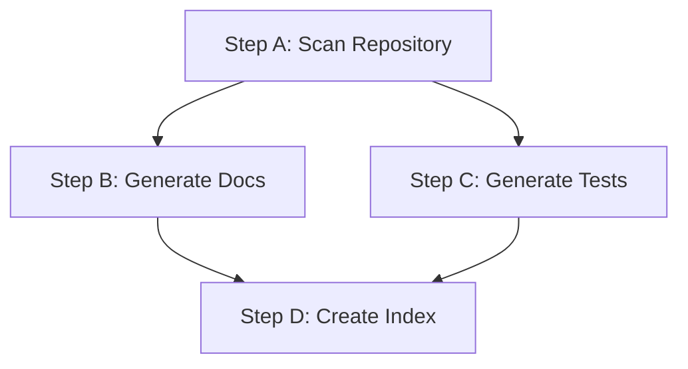

# Step 02: Dependencies

**Goal:** Map parallel vs sequential relationships between steps, confirm with a Mermaid diagram, and collect auth + data-passing strategy.

**MANDATE:** Load `knowledge/prompt-quality-guide.md` is NOT required here. But DO NOT load step-03 or step-04 yet.

---

## INITIALIZATION

Read `.workflow-creator-wip.md` from CWD to restore the step list and all data collected in Step 01 before doing anything else.

---

## EXECUTION SEQUENCE

### Phase A: Dependency Mapping

Start with this question:

> "Does any step need the output or result from another step before it can run? Or can all steps run independently?"

If the user indicates dependencies exist, ask for each potential dependency pair:

> "Does **[step-B]** need to wait for **[step-A]** to finish before it can start?"

Work through the step list systematically. Build a `needs:` map.

**Suggest parallelization** if the user describes a fully linear chain where no step actually uses the output of the previous step — they may have assumed sequential order is required when parallel would be faster.

> "I notice that [step-B] and [step-C] don't actually use [step-A]'s output — they could run in parallel with each other (and after [step-A] if you want, or at the same time). Would you like them to run in parallel?"

---

### Phase B: Acyclicity Validation

After each change to the dependency graph, validate that no cycles exist.

**Cycle detection:** Walk the graph. If any path leads back to a visited node, a cycle exists.

**If cycle detected:**

> "Circular dependency detected: [step-A] → [step-B] → [step-A]. Each step must eventually complete for the workflow to finish — cycles are not allowed in GitHub Actions.
>
> To fix this: [specific suggestion based on the cycle, e.g., 'remove the dependency from step-B back to step-A, or restructure so step-C aggregates both']."

Do not proceed until the graph is acyclic.

---

### Phase C: Mermaid Diagram

Generate and display a Mermaid diagram of the confirmed dependency graph.

Format:



Display the diagram and ask:

> "Does this dependency graph look correct?
> [Y] Yes, this is right
> [E] I need to make a change"

HALT and wait for selection.

- **[Y]:** Proceed to Phase D
- **[E]:** Ask what to change (e.g., "step-C should also depend on step-B"), apply the change, re-validate acyclicity, re-render the diagram, re-present. Repeat until user confirms.

---

### Phase D: Data-Passing Strategy

For each dependency edge (A → B), ask:

> "When [step-B] depends on [step-A], what does it need from [step-A]?
>
> - A **string value** (status, summary, file path, JSON snippet — a few KB): use GitHub Actions outputs
> - A **file or directory** (generated report, code files, artifacts — any size): use artifact upload/download"

Record for each edge:

- `strategy`: `"output"` or `"artifact"`
- If `"output"`: what key name (e.g., `summary`, `result`, `filepath`)
- If `"artifact"`: what artifact name and path (e.g., name: `step-a-output`, path: `output/`)

If there are many edges, batch the question:

> "For steps that receive only a status or short result, use outputs. For steps that receive files, use artifacts. Here are the edges — which strategy for each?"

---

### Phase E: Auth Method

Ask:

> "Which authentication method will this workflow use?
>
> **[1] Anthropic API key** (default — add `OPENCODE_API_KEY` as a GitHub Secret)
> **[2] GitHub Copilot** (uses your Copilot subscription — no Anthropic key needed)
> **[3] Custom provider / model config** (Azure OpenAI, Bedrock, etc. via config.json)
> **[4] Model override only** (Anthropic key + specify a specific model version)"

HALT and wait for selection.

Record `authMethod`:

- `[1]` → `"anthropic-api-key"`
- `[2]` → `"copilot-auth-json"`
- `[3]` → `"custom-opencode-config"`
- `[4]` → `"anthropic-api-key-with-model"`

If `[4]`, also ask:

> "Which model? (e.g., `anthropic/claude-sonnet-4-6`, `anthropic/claude-opus-4-6`)"

---

### Phase F: Timeout Strategy

Ask:

> "What should the default timeout be for each AI step, in minutes? (Default: 30 minutes — individual steps can override this)"

Record `defaultTimeout` (string, e.g., `"30"`).

**If the workflow has 5+ steps**, proactively suggest per-step timeout tuning:

> "With [N] steps, you may want different timeouts based on complexity:
>
> - **Heavy steps** (full codebase scans, diagram generation, deep analysis): consider 45 min
> - **Standard steps** (focused analysis on one aspect): 30 min (default)
> - **Light steps** (package.json parsing, flag inventory, script-driven work): 20 min
>
> Would you like me to suggest timeouts for each step, or use [default] for all?"

If the user wants per-step tuning, collect `timeout` overrides for individual steps and record them in the WIP alongside each step entry.

---

### Phase F2: Reusable Workflow Extraction

**If 3+ parallel jobs share the same structure** (checkout → download artifacts → auth → AI step → cleanup → upload), suggest extracting the common pattern:

> "I notice [N] of your steps share the same job structure. Would you like me to extract them into a reusable workflow to reduce YAML duplication?
>
> This creates a separate `.github/workflows/run-<workflowSlug>-step.yml` that each parallel job calls with different parameters. It reduces maintenance and makes adding new steps easier.
>
> [Y] Yes, extract reusable workflow
> [N] No, keep all jobs inline"

HALT and wait for selection.

Record `useReusableWorkflow: true/false` in the WIP.

**Important constraints to mention if user selects [Y]:**

- `continue-on-error` must go inside the reusable workflow, not on the caller job
- Workflow-level `env:` vars won't be available — values will be passed as inputs
- Secrets must be passed explicitly to each caller job

---

### Phase G: Summary Confirmation

Display a full summary:

```
Dependency graph confirmed. Here's the execution plan:

Parallel groups:
- [step-a] runs first
- [step-b] and [step-c] run in parallel after [step-a]
- [step-d] runs after both [step-b] and [step-c] complete

Data passing:
- [step-a] → [step-b]: artifact (name: step-a-output, path: output/)
- [step-a] → [step-c]: output (key: summary)

Auth: Anthropic API key (OPENCODE_API_KEY secret)
Default timeout: 30 minutes

[C] Confirm and continue to prompt authoring
[E] Make a change
```

HALT and wait for confirmation.

---

## WIP FILE UPDATE

After confirmation, update `.workflow-creator-wip.md` frontmatter:

```yaml
stepsCompleted: [1, 2]
dependencyGraph:
  step-b:
    needs: [step-a]
  step-c:
    needs: [step-a]
  step-d:
    needs: [step-b, step-c]
dataPassingEdges:
  step-a_to_step-b:
    strategy: artifact
    artifactName: step-a-output
    artifactPath: output/
  step-a_to_step-c:
    strategy: output
    outputKey: summary
authMethod: anthropic-api-key
defaultTimeout: '30'
useReusableWorkflow: false
runnerLabel: 'ubuntu-latest'
# Per-step timeout overrides (optional):
# steps[n].timeout: '45'
```

---

## NEXT STEP

After WIP is updated and user confirms:

Read fully and follow: `steps/step-03-prompts.md`
